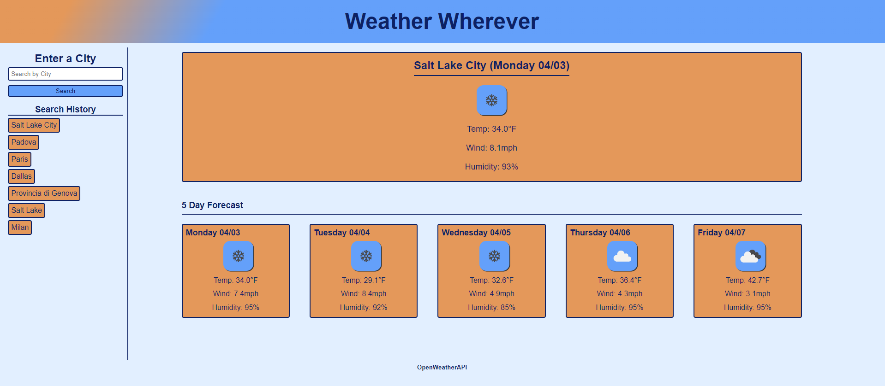

# On The Go Weather

## Description

This weather app uses the openweather apis for current day weather and also the 5 following days. You are able to type in a city in the input and it will then match it with the best city and retrieve the weather data. After it has retrieved the weather data it will display it on the app and show you the different days and weather.

## User Story

```
AS A traveler
I WANT to see the weather outlook for multiple cities
SO THAT I can plan a trip accordingly
```

## Acceptance Criteria

```
GIVEN a weather dashboard with form inputs
WHEN I search for a city
THEN I am presented with current and future conditions for that city and that city is added to the search history
WHEN I view current weather conditions for that city
THEN I am presented with the city name, the date, an icon representation of weather conditions, the temperature, the humidity, and the wind speed
WHEN I view future weather conditions for that city
THEN I am presented with a 5-day forecast that displays the date, an icon representation of weather conditions, the temperature, the wind speed, and the humidity
WHEN I click on a city in the search history
THEN I am again presented with current and future conditions for that city
```

## Installation

N/A

## Usage

This app is used for those looking to view the current weather and the weather for the following 5 days. They are able to search for the location by a city name.

## Credits

N/A

## Deployment

Follow the link for the deployed website https://bradenkim22.github.io/on-the-go-weather/

## License

Please refer to the LICENSE in the repo.

## Mock-Up


